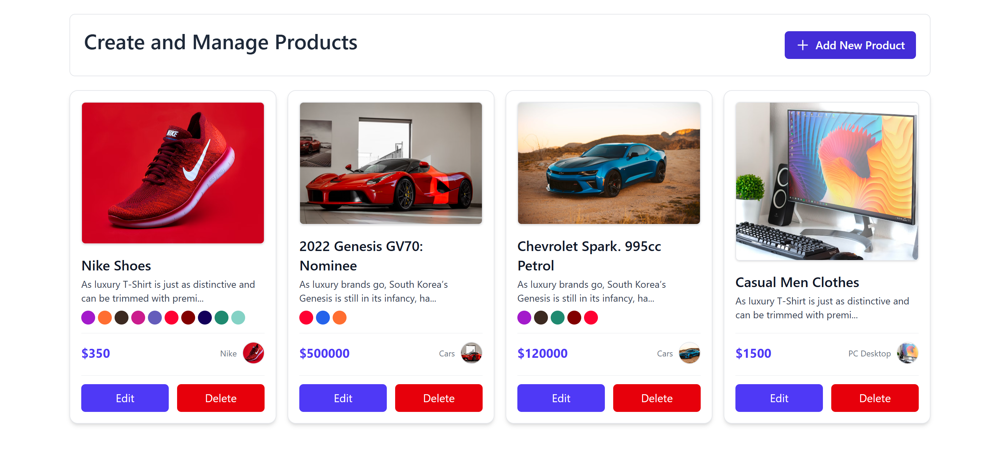

# 🛠️ Products Builder

A modern, responsive web application for managing and building product catalogs. Built with **React**, **TypeScript**, and **Vite**, featuring a clean interface powered by **TailwindCSS** with smooth animations and interactive elements.

---

## 🌐 Live Demo

🔗 **[View Live Demo on Vercel](https://advanced-product-builder.vercel.app/)**

---

## 🚀 Features

- ✅ **Product Management** - Add, edit, and delete products with ease
- 🎨 **Modern UI** - Clean, responsive design with TailwindCSS
- ⚡ **Fast Performance** - Built with Vite for lightning-fast development
- 🔒 **Type Safety** - Full TypeScript support for robust code
- 💫 **Smooth Animations** - Enhanced UX with Framer Motion
- 🔔 **Smart Alerts** - Beautiful confirmation dialogs with SweetAlert2
- 🆔 **Unique IDs** - Automatic UUID generation for each product
- 📱 **Mobile Responsive** - Works seamlessly on all devices
- 🎯 **Icon System** - Rich iconography with Heroicons and Lucide React
- 🧹 **Clean Code** - ESLint configuration for code quality

---

## 📸 Screenshots


*Main interface showing product management dashboard*

---

## 🛠️ Tech Stack

### Frontend
- **React 18** - Modern React with hooks
- **TypeScript** - Type-safe JavaScript
- **Vite** - Next-generation build tool
- **TailwindCSS** - Utility-first CSS framework

### UI/UX Libraries
- **Framer Motion** - Production-ready motion library
- **SweetAlert2** - Beautiful alert dialogs
- **Heroicons** - Beautiful hand-crafted SVG icons
- **Lucide React** - Simply beautiful icons
- **Headless UI** - Unstyled, accessible UI components

### Development Tools
- **ESLint** - Code linting and formatting
- **TypeScript ESLint** - TypeScript-specific linting rules
- **Vite Plugin React** - Fast refresh for React

---

## 📂 Project Structure

```
products-builder/
├── 📁 public/
│   ├── vite.svg
│   └── index.html
├── 📁 src/
│   ├── 📁 components/
│   │   ├── ProductCard.tsx
│   │   ├── ProductForm.tsx
│   │   └── ProductList.tsx
│   ├── 📁 types/
│   │   └── index.ts
│   ├── 📁 utils/
│   │   └── helpers.ts
│   ├── App.tsx
│   ├── main.tsx
│   └── index.css
├── 📄 package.json
├── 📄 tsconfig.json
├── 📄 vite.config.ts
├── 📄 tailwind.config.js
├── 📄 eslint.config.js
└── 📄 README.md
```

---

## 🚀 Quick Start

### Prerequisites
- Node.js 16+ and npm/yarn
- Git

### Installation

```bash
# Clone the repository
git clone https://github.com/abdelrahman-samy-dev/product-builder.git

# Navigate to project directory
cd product-builder

# Install dependencies
npm install

# Start development server
npm run dev
```

### Available Scripts

```bash
# Development server (http://localhost:5173)
npm run dev

# Build for production
npm run build

# Preview production build
npm run preview

# Run ESLint
npm run lint

# Type checking
npm run type-check
```

---

## 🎯 Usage

1. **Adding Products**: Click the "Add Product" button to create new products
2. **Editing Products**: Click the edit icon on any product card to modify details
3. **Deleting Products**: Use the delete button with confirmation dialog
4. **Searching**: Use the search bar to filter products by name or category
5. **Responsive Design**: Works perfectly on desktop, tablet, and mobile devices

---

## 🎨 Customization

### Styling
The app uses TailwindCSS for styling. You can customize the design by:
- Modifying `tailwind.config.js` for theme customization
- Updating component classes in individual React components
- Adding custom CSS in `src/index.css`

### Adding Features
- **Categories**: Extend the product model to include categories
- **Images**: Add image upload functionality
- **Inventory**: Include stock management features
- **Export/Import**: Add data export/import capabilities

---

## 🔧 Configuration

### Environment Variables
Create a `.env` file in the root directory:

```env
VITE_APP_TITLE=Products Builder
VITE_API_URL=your_api_url_here
```

### Vite Configuration
The project uses Vite with React plugin. Configuration is in `vite.config.ts`:

```typescript
import { defineConfig } from 'vite'
import react from '@vitejs/plugin-react'

export default defineConfig({
  plugins: [react()],
  // Add custom configuration here
})
```

---

## 📦 Dependencies

### Production Dependencies
```json
{
  "react": "^18.2.0",
  "react-dom": "^18.2.0",
  "@headlessui/react": "^1.7.17",
  "@heroicons/react": "^2.0.18",
  "framer-motion": "^10.16.4",
  "lucide-react": "^0.292.0",
  "sweetalert2": "^11.6.13",
  "uuid": "^9.0.1",
  "clsx": "^2.0.0"
}
```

### Development Dependencies
```json
{
  "@vitejs/plugin-react": "^4.0.3",
  "vite": "^4.4.5",
  "typescript": "^5.0.2",
  "eslint": "^8.45.0",
  "tailwindcss": "^3.3.3"
}
```

---

## 🌐 Deployment

### Deploy to Vercel

1. **Connect Repository**:
   - Visit [Vercel Dashboard](https://vercel.com/dashboard)
   - Click "New Project"
   - Import from GitHub: `https://github.com/abdelrahman-samy-dev/product-builder.git`

2. **Configure Settings**:
   - Framework Preset: `Vite`
   - Build Command: `npm run build`
   - Output Directory: `dist`

3. **Deploy**: Click "Deploy" and your app will be live!

### Deploy to Netlify

```bash
# Build the project
npm run build

# Deploy to Netlify
npm install -g netlify-cli
netlify deploy --prod --dir=dist
```

---

## 🤝 Contributing

Contributions are welcome! Please follow these steps:

1. **Fork the repository**
2. **Create a feature branch**: `git checkout -b feature/amazing-feature`
3. **Commit changes**: `git commit -m 'Add amazing feature'`
4. **Push to branch**: `git push origin feature/amazing-feature`
5. **Open a Pull Request**

### Code Style
- Follow the existing code style
- Run `npm run lint` before committing
- Write meaningful commit messages
- Add tests for new features

---

## 🐛 Known Issues

- [ ] Search functionality could be improved with debouncing
- [ ] Add drag-and-drop for product reordering
- [ ] Image upload feature pending implementation

---

## 📋 Roadmap

### Version 2.0
- [ ] **Database Integration** - Connect to a backend API
- [ ] **User Authentication** - Login/logout functionality  
- [ ] **Product Categories** - Organize products by categories
- [ ] **Image Upload** - Add product images
- [ ] **Export/Import** - CSV/JSON data management
- [ ] **Dark Mode** - Theme switching capability
- [ ] **Bulk Operations** - Select and manage multiple products

### Version 2.1
- [ ] **Inventory Management** - Stock tracking
- [ ] **Price History** - Track price changes
- [ ] **Analytics Dashboard** - Product insights
- [ ] **Mobile App** - React Native version

---

## 📄 License

This project is licensed under the MIT License - see the [LICENSE](LICENSE) file for details.

```
MIT License

Copyright (c) 2024 Abdelrahman Samy

Permission is hereby granted, free of charge, to any person obtaining a copy
of this software and associated documentation files (the "Software"), to deal
in the Software without restriction, including without limitation the rights
to use, copy, modify, merge, publish, distribute, sublicense, and/or sell
copies of the Software, and to permit persons to whom the Software is
furnished to do so, subject to the following conditions:

The above copyright notice and this permission notice shall be included in all
copies or substantial portions of the Software.
```

---

## 👨‍💻 Author

**Abdelrahman Samy**
- GitHub: [@abdelrahman-samy-dev](https://github.com/abdelrahman-samy-dev)
- LinkedIn: [Connect with me](https://www.linkedin.com/in/abdelrahman-samy-ali/)
- Email: [abdelrahman.samy.dev@gmail.com](mailto:abdelrahman.samy.dev@outlook.com)

---

## 🙏 Acknowledgments

- Thanks to the React team for the amazing framework
- Vite team for the blazing fast build tool
- TailwindCSS for the utility-first CSS framework
- All contributors who have helped improve this project

---

## ⭐ Show Your Support

If you like this project, please consider giving it a ⭐ on GitHub!

---

<div align="center">

**Made with ❤️ by [Abdelrahman Samy](https://github.com/abdelrahman-samy-dev)**

</div>
